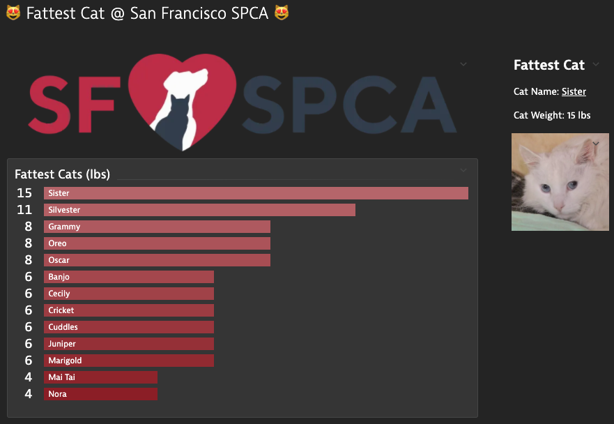

<h1 align="center">😻 Fattest Cat @ San Francisco SPCA 😻<project-name></h1>

<p align="center"><b>Scripting Integration + JS</b><project-description></p>
<p align="center"><i>Some cats are born fat, some achieve fatness, others have fatness thrust upon them. You can find all of them at the San Francisco SPCA.<project-description></i></p>

<p align="center">
  
</p>

## Overview
In this exercise you'll learn how to ingest the name and weight (lbs) of each cat up for adoption at the San Francisco SPCA into Dynatrace. We will use `dynatrace_ingest` to ingest these metrics to see which one weighs the most by continuously monitoring them in Dynatrace.

### Prerequisites
- Node.js
- Linux
- npm
- git

### Step 1: Getting Started

1. Pull down the code repo.

   ```bash
   git clone https://github.com/geoteo/dt-fat-cat-hack-js
   ```

2. Change directories.

    ```bash
    cd dt-fat-cat-hack-js
    ```
3. Install the necessary packages.

   ```bash
   npm i
   ```
4. Review the code in `src/fetch_cats.js` and `src/print_fattest_cat.js` using your favorite editor.

5. Review the following Dynatrace documentation [Metric ingestion protocol](https://www.dynatrace.com/support/help/how-to-use-dynatrace/metrics/metric-ingestion/metric-ingestion-protocol).

### Step 2. Execute the script to perform a single iteration. 

1. Provided data points must follow the metrics ingestion protocol. The general syntax of metric ingestion is the following:

   ```bash
   metric.key,dimensions payload
   ```

2. Run the script.

   ```bash
   node src/print_fattest_cat.js
   ```

3. Review output to terminal.


### Step 3. Automate the process to execute the script every 10 seconds! 

1. Run the following bash command in your terminal:

   ```bash
    while true; do node src/print_fattest_cat.js; sleep 10; done
   ```

### Step 4. Query Data in Data Explorer

1. Dynatrace UI -> Explore Data -> animal.cat.weight -> Max -> Split by name
